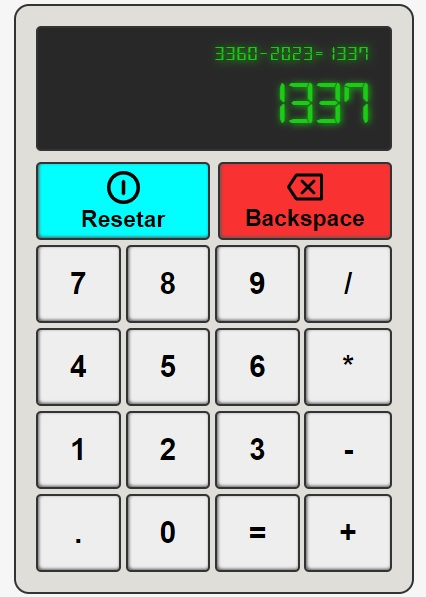

# Calculadora
Calculadora desenvolvida em Javascript com todas as funções de uma calculadora simples.

Live preview: 
[Clique aqui para acessar](https://lcarrati.github.io/Calculadora/) 

&nbsp;
> Recursos em destaque:
- Operações Matemáticas Básicas: Soma, subtração, multiplicação e divisão são executadas com precisão.
- Histórico de Cálculo: Mostra no visor a última operação realizada
- Memória de Cálculo: Armazena o último valor calculado para operações posteriores, permitindo uma experiência mais fluida.
- Interface Intuitiva: Oferece duas maneiras de operar - botões virtuais na tela para interação com o mouse e a capacidade de inserir equações diretamente pelo teclado para eficiência adicional.
- Código Pura: Construída exclusivamente com JavaScript, HTML e CSS sem dependências externas.
- Redimensionamento automático: Quando números muito grandes são digitados, a calculadora realiza um redimensionamento automático para acomodar esses números.

&nbsp;
> Tecnologias utilizadas:
- Javascript Vanilla
- CSS
- HTML

&nbsp;
### Objetivo:
Meu objetivo com este projeto foi aplicar técnicas avançadas de manipulação do DOM utilizando JavaScript, com o propósito de criar uma calculadora que reproduza fielmente as funcionalidades de uma calculadora real. Isso envolveu o desenvolvimento de funções que executam operações matemáticas e fornecem feedback visual dos resultados, além de identificar erros, como tentativa de divisão por zero ou operações com números excessivamente grandes.

&nbsp;
## Experimente a calculadora! 
[Clique aqui para acessar](https://lcarrati.github.io/Calculadora/)

&nbsp;

